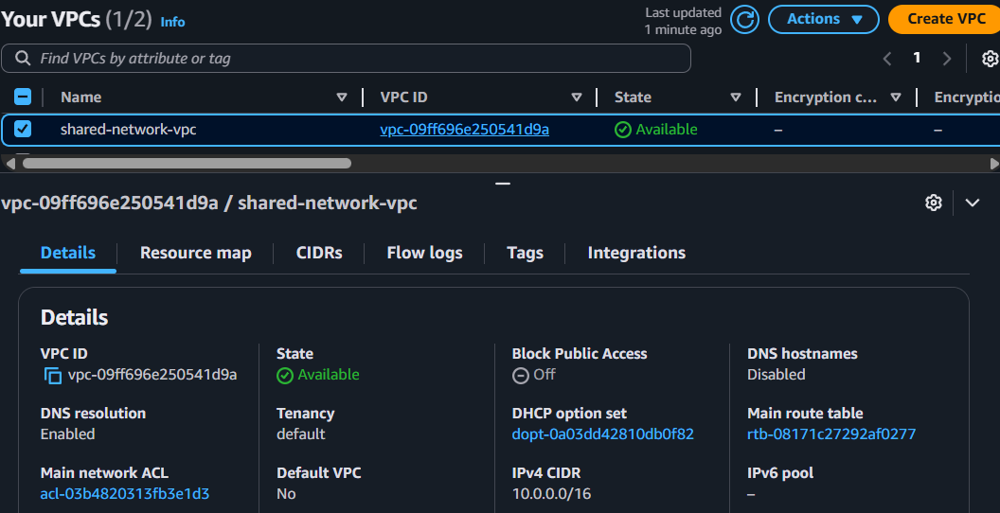
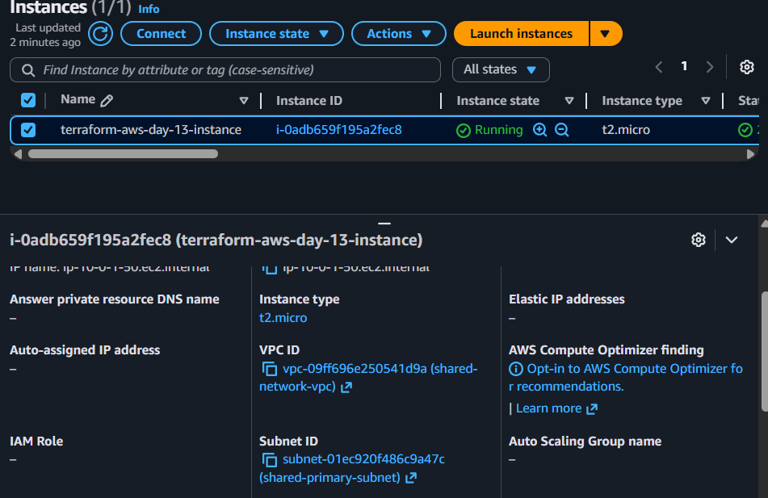
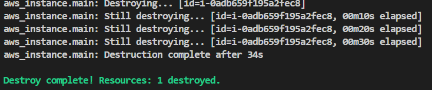

# Day 13: Terraform Data Sources with AWS

This lesson demonstrates how to use Terraform data sources to reference existing infrastructure in AWS. We will provision an EC2 instance into a pre-existing VPC and subnet.

## Scenario

We have a "shared" VPC and subnet that were created by another team or process. Our task is to launch a new EC2 instance into this existing network infrastructure without managing the VPC or subnet with our Terraform configuration.

## Pre-existing Infrastructure

The following resources are assumed to exist in your AWS account:

- **VPC**: with the tag `Name = shared-network-vpc`
- **Subnet**: with the tag `Name = shared-primary-subnet`

## Terraform Configuration (main.tf)

Our Terraform code will:

### Define Data Sources:

- `data "aws_vpc" "shared"`: This block tells Terraform to find a VPC with the tag `Name` set to `shared-network-vpc`.
- `data "aws_subnet" "shared"`: This block finds a subnet with the tag `Name` set to `shared-primary-subnet` within the VPC found by the previous data source.
- `data "aws_ami" "amazon_linux_2"`: This block finds the latest Amazon Linux 2 AMI to use for our EC2 instance.

### Use Data Source Outputs:

- The `aws_instance` resource uses `data.aws_subnet.shared.id` to launch into the existing subnet.
- The `aws_instance` resource also uses `data.aws_ami.amazon_linux_2.id` for the AMI.

## How to Run This Demo

### 1. Create the Pre-existing Infrastructure

First, we need to simulate the creation of the shared network resources. You can create these resources manually in the AWS console or using a separate Terraform configuration.

The resources should have the following tags:
- VPC: `Name = shared-network-vpc`
- Subnet: `Name = shared-primary-subnet`




### 2. Provision the EC2 Instance

Now, we'll run the main Terraform configuration that uses data sources.

```bash
cd Day-13/terraform
terraform init
terraform plan
```

**Expected Plan Output**: The plan should show that Terraform will create 1 new resource: an `aws_instance`. It should **not** show any changes to the VPC or subnet.

```bash
terraform apply -auto-approve
```



### 3. Verification

1. Go to the AWS EC2 console.
2. Find the instance named `day13-instance`.
3. Check its "Networking" details. You will see that it is in the `shared-network-vpc` and `shared-primary-subnet`, confirming that the data sources worked correctly.

### 4. Cleanup

To destroy the resources created in this lesson:

```bash
# Destroy the instance
cd Day-13/terraform
terraform destroy -auto-approve
```



**Note**: This will only destroy the EC2 instance. The shared VPC and subnet will remain since they are not managed by this Terraform configuration.

## Key Takeaways

- **Data sources** allow Terraform to reference existing infrastructure without managing it.
- Data sources are read-only and do not modify the infrastructure.
- You can use data source outputs (like `data.aws_vpc.shared.id`) in your resource definitions.
- This pattern is useful when working with shared infrastructure or resources managed by other teams.
