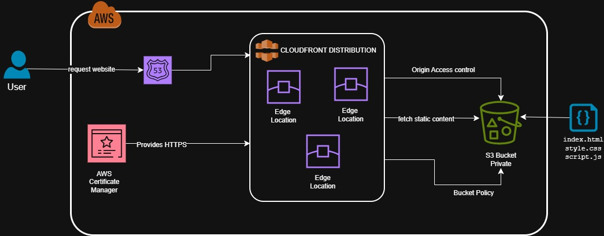

# Day 14: Static Website Hosting (Mini Project)

##  Project Overview

This mini project demonstrates how to deploy a static website on AWS using Terraform. We'll create a complete static website hosting solution using S3 for storage and CloudFront for global content delivery.

##  Architecture

```
Internet → CloudFront Distribution → S3 Bucket (Static Website)
```


### Components:
- **S3 Bucket**: Hosts static website files (HTML, CSS, JS)
- **CloudFront Distribution**: Global CDN for fast content delivery
- **Public Access Configuration**: Allows public reading of website files

##  Project Structure

```
Day-14/
└── terraform/
├── backend.tf # Remote state (S3)
├── main.tf # Main Terraform configuration
├── outputs.tf # Output values
├── provider.tf # Provider config
├── variables.tf # Input variables
└── www/ # Website source files
├── index.html
├── style.css
└── script.js
```

##  Features

### Website Features:
- **Modern Responsive Design**: Works on desktop and mobile
- **Dark/Light Theme Toggle**: Switch between themes (saves preference)
- **Interactive Elements**: Click counter, status updates
- **AWS Branding**: Professional layout showcasing AWS services
- **Animations**: Smooth transitions and loading effects

### Infrastructure Features:
- **S3 Static Website Hosting**: Reliable file storage and serving
- **CloudFront CDN**: Global content delivery with HTTPS
- **Proper MIME Types**: Correct content-type headers for all files
- **Public Access**: Secure public read access configuration

##  Prerequisites

1. **AWS CLI** configured with appropriate credentials
2. **Terraform** installed (version 1.0+)
3. **AWS Account** with sufficient permissions for:
   - S3 bucket creation and management
   - CloudFront distribution creation
   - IAM policies for S3 public access

##  Deployment Steps

### 1. Initialize Terraform
```bash
cd Day-14/terraform
terraform init
```

### 2. Review the Plan
```bash
terraform plan
```

### 3. Deploy Infrastructure
```bash
terraform apply
```
Type `yes` when prompted to confirm deployment.

### 4. Access Your Website
After deployment completes, Terraform will output the CloudFront URL:
```
website_url = "https://d2nrhnei8a1w1m.cloudfront.net"
```

##  Resources Created

| Resource Type | Purpose | Count |
|---------------|---------|-------|
| S3 Bucket | Website hosting | 1 |
| S3 Bucket Policy | Public read access | 1 |
| S3 Objects | Website files (HTML, CSS, JS) | 3 |
| CloudFront Distribution | Global CDN | 1 |

##  Configuration Details

### S3 Configuration:
- **Bucket naming**: Auto-generated with prefix `my-static-website-`
- **Website hosting**: Enabled with `index.html` as default
- **Public access**: Configured for read-only public access
- **Content types**: Proper MIME types for web files

### CloudFront Configuration:
- **Origin**: S3 bucket regional domain
- **Caching**: Standard web caching (1 hour default TTL)
- **HTTPS**: Automatic redirect from HTTP to HTTPS
- **Global**: Available worldwide (PriceClass_100)


##  Cleanup

To destroy all resources and avoid charges:
```bash
terraform destroy
```
Type `yes` when prompted to confirm destruction.

##  Learning Objectives

After completing this project, you should understand:
- ✅ How to configure S3 for static website hosting
- ✅ Setting up CloudFront distributions
- ✅ Managing S3 bucket policies and public access
- ✅ Terraform file provisioning with `for_each`
- ✅ Proper MIME type configuration for web assets
- ✅ AWS CDN concepts and caching strategies

## 🔗 Useful Links

- [AWS S3 Static Website Hosting Guide](https://docs.aws.amazon.com/AmazonS3/latest/userguide/WebsiteHosting.html)
- [CloudFront Documentation](https://docs.aws.amazon.com/cloudfront/)
- [Terraform AWS Provider](https://registry.terraform.io/providers/hashicorp/aws/latest/docs)

## 🎉 Next Steps

Consider extending this project with:
- Custom domain name with Route 53
- SSL certificate with AWS Certificate Manager
- CI/CD pipeline for automatic deployments
- Multiple environments (dev, staging, prod)
- Advanced CloudFront configurations (custom error pages, security headers)

---
**Note**: This project uses CloudFront's default domain. For production websites, consider using a custom domain with Route 53 and ACM for SSL certificates.