## Day 15: Cross-Region VPC Peering (Mini Project)

## Overview
- Builds two AWS VPCs in different regions (`us-east-1` primary, `us-west-2` secondary) and peers them so instances can talk over private IPs.
- Each VPC gets a public subnet, IGW, route table, security group, and one EC2 instance bootstrapped with Apache to show region and private IP.
- Uses provider aliases for multi-region deployments (see [terraform/providers.tf](terraform/providers.tf)).

## Architecture

### Primary VPC (us-east-1)
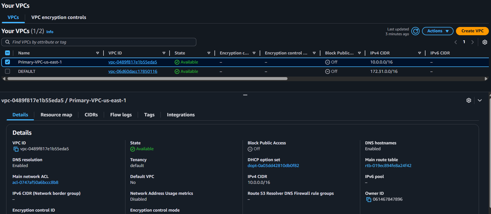

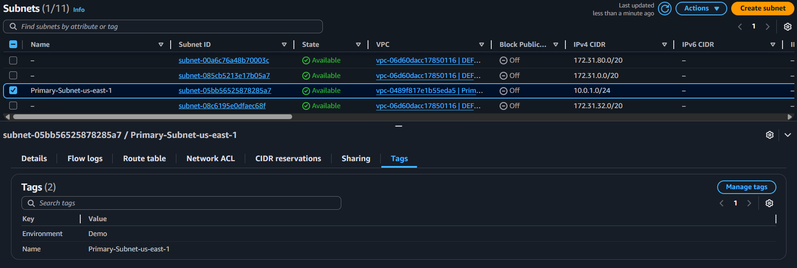

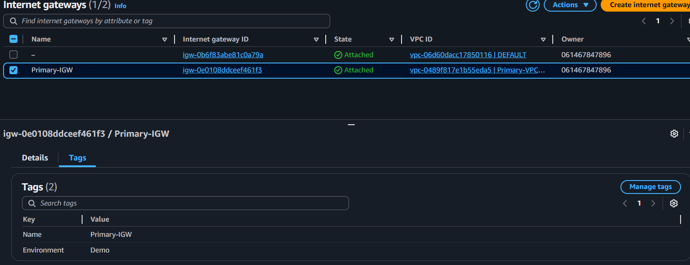

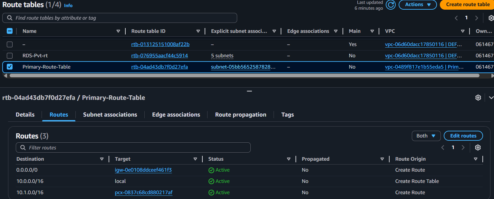

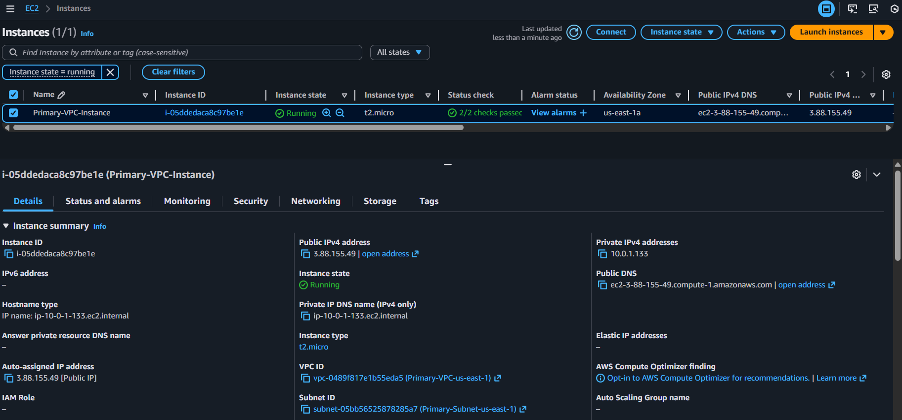

### Secondary VPC (us-west-2)
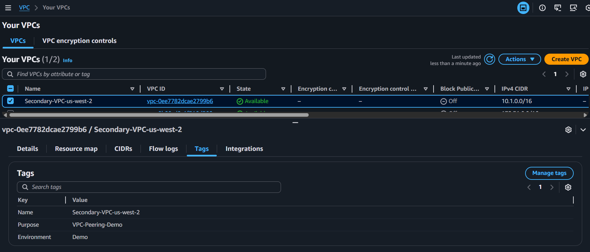

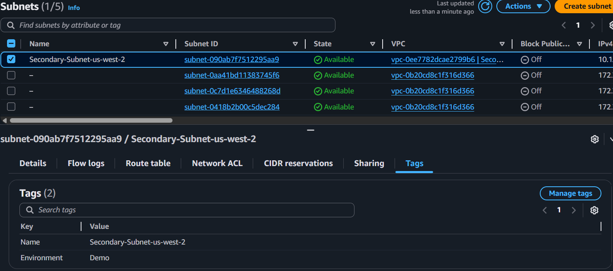

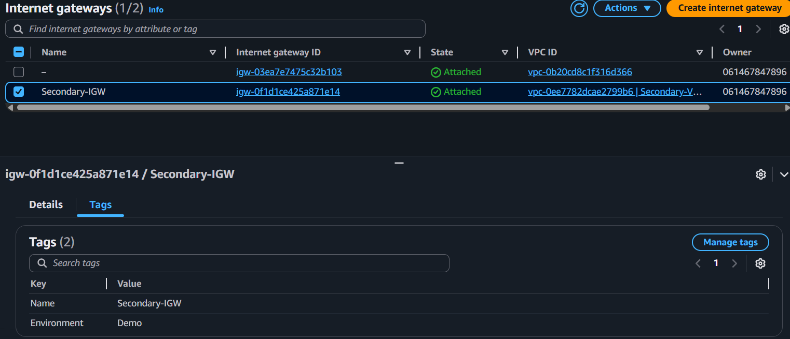

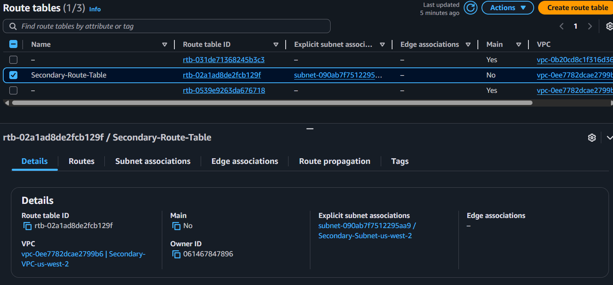

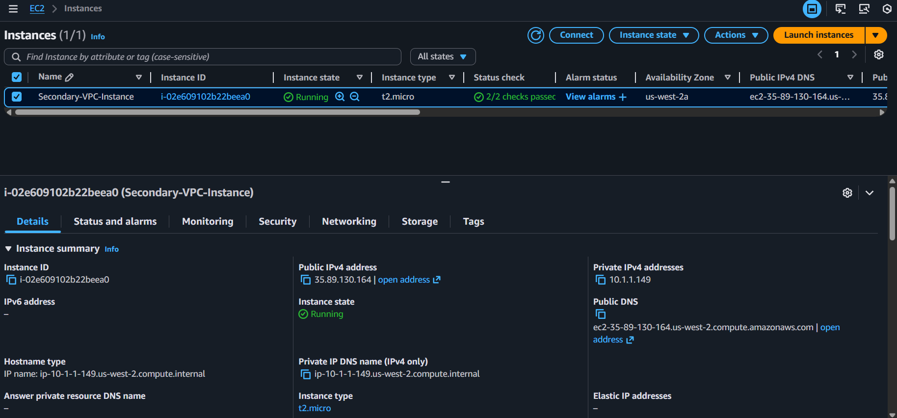

### VPC Peering Connection
.png)

.png)

## ## What the stack creates
- VPCs, subnets, IGWs, route tables, and associations for each region: [terraform/main.tf](terraform/main.tf)
- Cross-region VPC peering (requester + accepter) with routes for opposite CIDRs: [terraform/main.tf](terraform/main.tf)
- Security groups allowing SSH (0.0.0.0/0 for demo) and all TCP/ICMP between the two CIDRs: [terraform/main.tf](terraform/main.tf)
- EC2 instances (default `t2.micro`) using Ubuntu 24.04 LTS AMIs via data sources: [terraform/data.tf](terraform/data.tf)
- User data installs Apache and renders a region/IP page: [terraform/locals.tf](terraform/locals.tf)
- Outputs for VPC IDs, peering ID/status, and instance public/private IPs: [terraform/outputs.tf](terraform/outputs.tf)

## ## Inputs
- Regions, CIDRs, subnet CIDRs, instance type, and key pair names are set in [terraform/variables.tf](terraform/variables.tf).
- Example values live in [terraform/terraform.tfvars](terraform/terraform.tfvars). Update `primary_key_name` and `secondary_key_name` to match your key pairs.

## ## Prerequisites
- Terraform >= 1.0
- AWS credentials with permissions to create VPC, EC2, and networking resources in both regions
- Two EC2 key pairs (one per region) or reuse a shared name if you prefer; record their names for the tfvars file

## ## Quick start
1) Copy and edit tfvars
```sh
cd Day-15/terraform
# ensure terraform.tfvars has your key pair names
```

2) Initialize and review
```sh
terraform init
terraform plan
```

3) Apply
```sh
terraform apply
# type yes when prompted
```

4) Validate peering
- Get outputs: `terraform output`
- SSH to primary: `ssh -i <primary-key.pem> ubuntu@<primary_public_ip>`
	- Ping secondary private IP: `ping <secondary_private_ip>`
	- Curl secondary HTTP page: `curl http://<secondary_private_ip>`
- SSH to secondary similarly and ping/curl the primary private IP.

## Validation Results

### Testing Primary VPC HTTP Response
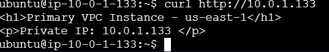

### Testing Secondary VPC HTTP Response
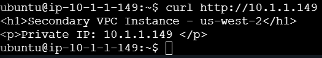

## ## Cleanup
```sh
terraform destroy
```

## ## Notes and guardrails
- Ensure VPC CIDRs do not overlap; defaults are 10.0.0.0/16 and 10.1.0.0/16.
- Security groups are intentionally permissive for demo; restrict SSH sources and inter-VPC ports for real use.
- VPC peering is non-transitive and does not support edge-to-edge routing.

## ## Learning outcomes
- Configure provider aliases for multi-region work.
- Establish and route cross-region VPC peering.
- Harden security groups for inter-VPC traffic.
- Bootstrap instances with user data for quick validation.
