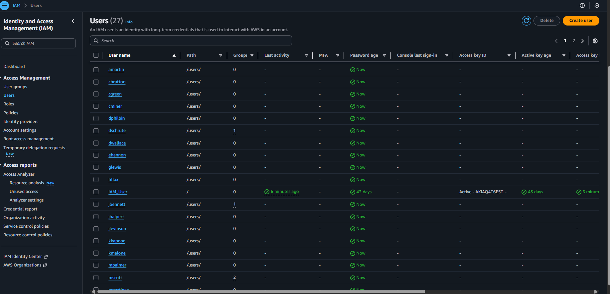
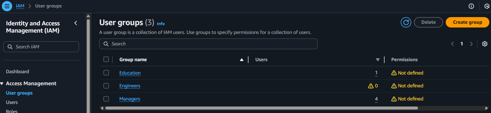

# Day 16: AWS IAM User Management with Terraform

Manage AWS IAM users, groups, and group memberships from a CSV file using Terraform. This is an AWS-focused equivalent of Azure AD user onboarding.

## What gets created

- IAM users from `users.csv` (username format: first initial + last name, lowercased)
- Console access with password-reset-required login profiles
- Three IAM groups: Education, Managers, Engineers
- Group memberships driven by CSV attributes
- Tags on each user: DisplayName, Department, JobTitle, Email, Phone, EmployeeID
- Group policy attachments:
	- Education: AWS managed `ReadOnlyAccess`
	- Managers: AWS managed `AdministratorAccess`
	- Engineers: custom `EngineerEC2LimitedAccess` (describe/start/stop EC2)

## Repository layout

```
Day-16/
├── Readme.md           # This guide
├── Assets/             # Architecture/policy screenshots
└── terraform/
		├── backend.tf      # S3 remote state config
		├── groups.tf       # Groups, memberships, policy attachments
		├── main.tf         # CSV decode, user + login profiles, outputs
		├── policies.tf     # Custom EC2 policy for engineers
		├── provider.tf     # AWS provider region
		├── users.csv       # User source data
		└── versions.tf     # Provider constraints
```

## Visual references

- User list: 
- Group memberships: 
- Education policy attachment: .png)
- Managers policy attachment: .png)
- Engineers custom policy: .png)


## Prerequisites

- AWS CLI configured with credentials that can manage IAM
- Terraform v1.0+
- An S3 bucket for remote state (see backend setup)

## Backend setup

Remote state is configured in [terraform/backend.tf](terraform/backend.tf):

- Bucket: `my-aws-terraform-state-bucket-amit-123`
- Key: `Day-16/terraform/terraform.tfstate`
- Region: `us-east-1`

If you prefer a different bucket, update `backend.tf` and create the bucket with versioning enabled:

```powershell
aws s3 mb s3://<your-bucket> --region us-east-1
aws s3api put-bucket-versioning --bucket <your-bucket> --versioning-configuration Status=Enabled
```

## How it works

1) Data source: [terraform/main.tf](terraform/main.tf#L8-L13) decodes `users.csv` into `local.users`.

2) Users: For each entry in `local.users`, [terraform/main.tf](terraform/main.tf#L15-L36) creates an IAM user with a predictable username and tags.

3) Console access: [terraform/main.tf](terraform/main.tf#L38-L55) creates `aws_iam_user_login_profile` with `password_reset_required = true`. Passwords are not output; users must reset on first login.

4) Groups: [terraform/groups.tf](terraform/groups.tf#L1-L27) defines Education, Managers, and Engineers.

5) Memberships: [terraform/groups.tf](terraform/groups.tf#L29-L62) adds users based on attributes:
	 - Education: `Department == "Education"`
	 - Managers: `JobTitle` contains `Manager` or `CEO`
	 - Engineers: `Department == "Engineering"`

6) Policies: [terraform/policies.tf](terraform/policies.tf#L1-L20) defines `EngineerEC2LimitedAccess`; [terraform/groups.tf](terraform/groups.tf#L64-L90) attaches policies to each group.

7) Outputs: [terraform/main.tf](terraform/main.tf#L1-L24) and [terraform/groups.tf](terraform/groups.tf#L92-L101) expose `account_id`, `user_names`, `user_passwords` (message only, sensitive), and a group-to-policy map.

## Run it

From `Day-16/terraform`:

```powershell
terraform init
terraform plan
terraform apply -auto-approve
```

After apply, useful checks:

```powershell
terraform output account_id
terraform output user_names
terraform output user_passwords   # sensitive placeholder text
terraform output group_policy_mapping
```

## Customize

- Add or edit users in [terraform/users.csv](terraform/users.csv). Example row:

	```csv
	first_name,last_name,email,phone,employee_id,department,job_title
	Jane,Doe,jane.doe@example.com,+1-202-555-9999,EMP030,Engineering,Software Engineer
	```

- Change username format in `aws_iam_user.users` (e.g., to `firstname.lastname`).
- Adjust group rules in [terraform/groups.tf](terraform/groups.tf) (e.g., broaden the manager regex or engineer department).
- Attach additional policies with `aws_iam_group_policy_attachment` resources.

## Passwords

Terraform does not expose generated passwords without a PGP key. Current output only notes that a password exists and must be reset. To set or rotate passwords yourself:

```powershell
aws iam create-login-profile --user-name <user> --password "TempPassword123!" --password-reset-required
```

## Cleanup

```powershell
terraform destroy
```

This removes the IAM users, groups, memberships, and related resources created by this demo.
