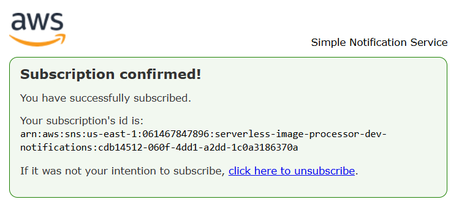
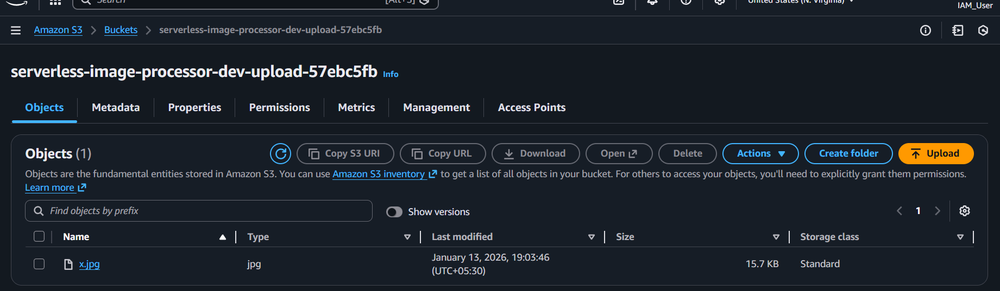
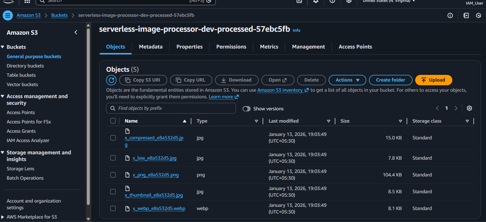
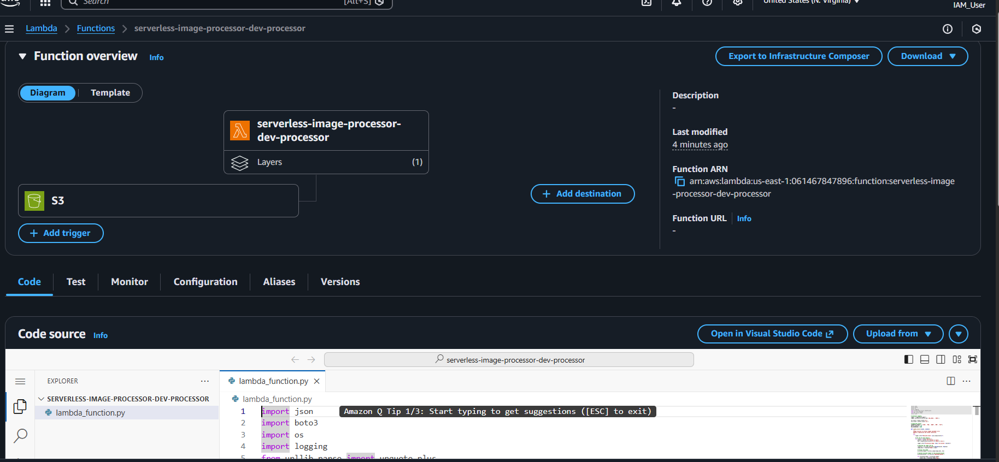
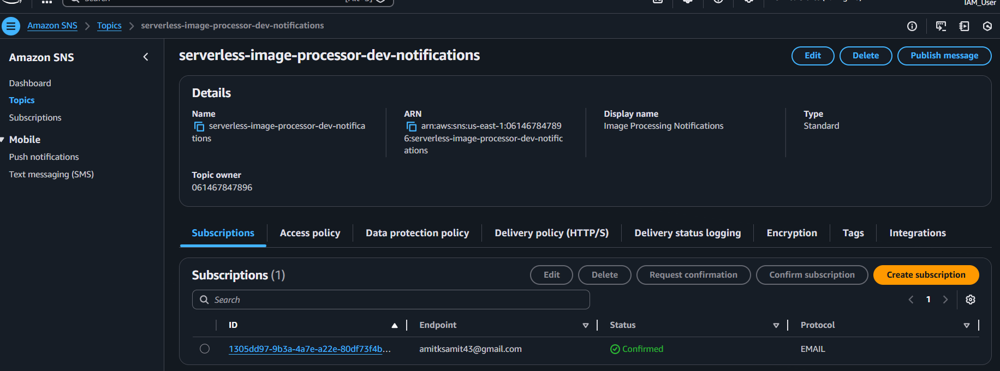

# Serverless Image Processor with SNS Notifications

## Overview

This project implements a serverless image processing pipeline using AWS services and Terraform. When you upload an image to an S3 bucket, it automatically triggers a Lambda function that processes the image into multiple formats and sizes. The processed images are saved to another S3 bucket, and you receive an email notification with processing details.

The infrastructure is fully automated using Terraform, making it easy to deploy and manage. The Lambda function uses the Pillow library for image manipulation, packaged as a Lambda Layer for optimal performance.

## Architecture

```
User Upload → S3 Upload Bucket → Lambda (Pillow) → S3 Processed Bucket → SNS → Email
```

**Components:**
- S3 Upload Bucket (source images)
- S3 Processed Bucket (processed images)
- Lambda Function (image processor)
- Lambda Layer (Pillow library)
- SNS Topic (email notifications)
- IAM Roles (permissions)
- CloudWatch Logs (monitoring)

## Features

- Automatic image processing triggered by S3 uploads
- Creates 5 variants per image (compressed, low-quality, WebP, PNG, thumbnail)
- Email notifications with processing details
- Supports multiple image formats (JPEG, PNG, WebP, BMP, TIFF, GIF)
- Auto-resizes large images (max 4096px)
- Secure infrastructure with private buckets and encryption
- Infrastructure as Code using Terraform
- CloudWatch logging for debugging
- Cost-effective (~$0.14/month for 1,000 images)

## Project Structure

```
Day-18/
├── lambda/
│   └── lambda_function.py          # Image processing code
│
├── scripts/
│   ├── build_layer_docker.sh       # Build Pillow layer
│   ├── deploy.sh                   # Deploy infrastructure
│   └── destroy.sh                  # Cleanup resources
│
├── terraform/
│   ├── main.tf                     # Infrastructure definitions
│   ├── variables.tf                # Input variables
│   ├── outputs.tf                  # Output values
│   ├── provider.tf                 # AWS provider config
│   ├── terraform.tfvars.example    # Example configuration
│   └── terraform.tfvars            # Your configuration (gitignored)
│
└── Readme.md
```

## How to Run This Project

### Prerequisites

1. **Docker Desktop** - Must be running (https://www.docker.com/products/docker-desktop/)
   - **Why needed:** AWS Lambda runs on Linux, but you may be on Windows/Mac. Docker creates a Linux environment to build the Pillow library with Linux-compatible binaries that Lambda can use.

2. **AWS CLI** - Configured with credentials (https://aws.amazon.com/cli/)
3. **Terraform** - Version 1.0+ (https://www.terraform.io/downloads)

### Setup

**1. Clone the repository**

```bash
git clone <repository-url>
cd Day-18
```

**2. Configure Terraform variables**

```bash
cd terraform
cp terraform.tfvars.example terraform.tfvars
```

Edit `terraform.tfvars`:

```hcl
aws_region         = "us-east-1"
environment        = "dev"
project_name       = "serverless-image-processor"
lambda_timeout     = 60
lambda_memory_size = 1024
notification_email = "your-email@example.com"  # or "" to disable
```

### Method 1: Using Scripts (Automated)

**Step 1: Build Lambda Layer**

Start Docker Desktop first, then:

```bash
cd scripts
./build_layer_docker.sh
```

This creates the Pillow layer for Lambda (takes 2-3 minutes).

**What this does:** Uses Docker to create a Linux container, installs Pillow inside it, and packages it as a zip file. This ensures the library works on AWS Lambda regardless of your operating system.

**Step 2: Deploy Infrastructure**

```bash
./deploy.sh
```

This will:
- Build the Lambda layer
- Initialize Terraform
- Create deployment plan
- Deploy all resources
- Display outputs

**Step 3: Confirm Email Subscription**

Check your email and click "Confirm subscription" in the AWS notification.



**Step 4: Test the Processor**

```bash
# Get bucket name from output
aws s3 cp test-image.jpg s3://YOUR-UPLOAD-BUCKET/
```

### Method 2: Using Terraform (Manual)

**Step 1: Build Lambda Layer**

Start Docker Desktop first, then:

```bash
cd scripts
./build_layer_docker.sh
```

**What this does:** Uses Docker to create a Linux container, installs Pillow inside it, and packages it as a zip file. This ensures the library works on AWS Lambda regardless of your operating system.

**Step 2: Initialize Terraform**

```bash
cd ../terraform
terraform init
```

**Step 3: Review Deployment Plan**

```bash
terraform plan
```

**Step 4: Deploy Infrastructure**

```bash
terraform apply
```

Type `yes` when prompted.

**Step 5: Confirm Email Subscription**

Check your email and click "Confirm subscription".


**Step 6: Test the Processor**

```bash
# Get bucket name
terraform output upload_bucket_name

# Upload image
aws s3 cp test-image.jpg s3://YOUR-UPLOAD-BUCKET/
```

### Verify Deployment

**Check processed images:**

```bash
terraform output processed_bucket_name
aws s3 ls s3://YOUR-PROCESSED-BUCKET/ --recursive
```

**Upload Bucket (with original image):**



**Processed Bucket (with 5 variants):**



**Lambda Function Overview:**



**SNS Topic with Email Subscription:**



**View Lambda logs:**

```bash
terraform output lambda_function_name
aws logs tail /aws/lambda/YOUR-LAMBDA-FUNCTION --follow
```

### Cleanup AWS Resources

**Method 1: Using Script**

```bash
cd scripts
./destroy.sh
```

This will:
- Empty both S3 buckets
- Destroy all Terraform resources

**Method 2: Using Terraform**

```bash
cd terraform
terraform destroy
```

Type `yes` when prompted.

**Note:** The `force_destroy = true` setting ensures S3 buckets are automatically emptied before deletion.

## Email Notification

After an image is successfully processed, you'll receive an email notification with complete details about all the generated variants.

**Example Email Notification:**

The email includes:
- Original image filename
- Processing bucket name
- Number of variants created
- Details for each variant (format, quality, file size)
- AWS CLI commands to download the files
- Direct link to S3 console

**Sample notification:** See [email-notification-example.pdf](Assets/email-notification-example.pdf) for a complete example of what you'll receive.

## Resources

**Official Documentation:**
- AWS Lambda - https://docs.aws.amazon.com/lambda/
- AWS S3 - https://docs.aws.amazon.com/s3/
- AWS SNS - https://docs.aws.amazon.com/sns/
- Terraform AWS Provider - https://registry.terraform.io/providers/hashicorp/aws/latest/docs
- Pillow Library - https://pillow.readthedocs.io/

**Tools:**
- Docker Desktop - https://www.docker.com/products/docker-desktop/
- AWS CLI - https://aws.amazon.com/cli/
- Terraform - https://www.terraform.io/downloads

---

**Built with Terraform, AWS Lambda, Python, and Pillow**

Happy deploying!
