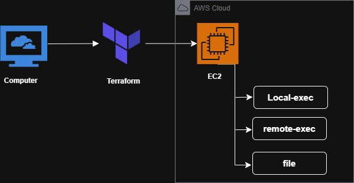

# Terraform Provisioners Demo

## 📚 What Are Provisioners?

**Provisioners** are Terraform's way to execute scripts or commands during resource creation or destruction. They enable you to perform actions that go beyond Terraform's declarative resource management.

### Key Concepts

- **Provisioners run during resource lifecycle events** (creation or destruction)
- **They are a "last resort"** - Terraform recommends using native cloud-init, user_data, or configuration management tools when possible
- **They execute only once** during resource creation (not on updates)
- **Failure handling**: By default, if a provisioner fails, the resource is marked as "tainted" and will be recreated on next apply

> 📖 **Complete Tutorial**: For a detailed walkthrough with practical examples, check out the [Day 19: Terraform Provisioners in Action blog post](https://dev.to/amit_kumar_7db8e36a64dd45/-day-19-terraform-provisioners-in-action-a-hands-on-demo-local-exec-remote-exec-file-510f)

### Architecture Overview



---

## 🔧 Types of Provisioners

This demo covers the three most common provisioner types:

### 1. **local-exec** Provisioner
- **Where it runs**: On the machine executing Terraform (your laptop, CI/CD server)
- **Connection required**: No
- **Use cases**:
  - Trigger webhooks or API calls
  - Update local inventory files
  - Run local scripts for orchestration
  - Send notifications (Slack, email)
  - Register resources in external systems

### 2. **remote-exec** Provisioner
- **Where it runs**: On the remote resource via SSH/WinRM
- **Connection required**: Yes (SSH for Linux, WinRM for Windows)
- **Use cases**:
  - Install packages (nginx, docker, etc.)
  - Run initialization commands
  - Configure system settings
  - Start services or daemons
  - Quick bootstrap tasks

### 3. **file** Provisioner
- **Where it runs**: Copies files from local to remote
- **Connection required**: Yes (SSH for Linux, WinRM for Windows)
- **Use cases**:
  - Copy configuration files
  - Deploy scripts for execution
  - Transfer SSL certificates
  - Upload application binaries

---

## 🎯 Provisioner Best Practices

### ✅ DO:
- Use provisioners as a **last resort**
- Prefer cloud-init, user_data, or AMI baking (Packer)
- Keep provisioner scripts idempotent
- Handle errors gracefully with `on_failure` parameter
- Use `connection` timeouts to avoid hanging
- Test thoroughly in non-production environments

### ❌ DON'T:
- Use provisioners when native Terraform resources exist
- Rely on provisioners for critical configuration
- Forget that provisioners only run on creation
- Store sensitive data in provisioner commands
- Use complex logic - move to proper config management tools

---

## 🔄 Connection Block

For **remote-exec** and **file** provisioners, you need a `connection` block:

```hcl
connection {
  type        = "ssh"              # or "winrm" for Windows
  user        = "ubuntu"           # SSH user
  private_key = file("~/.ssh/id_rsa")  # SSH private key
  host        = self.public_ip     # Target host
  timeout     = "5m"               # Connection timeout
}
```

---

## 📖 How to Use This Demo

### Prerequisites
- AWS credentials available (environment variables, shared credentials, or other supported mechanism)
- An existing EC2 key pair in the chosen region
- The private key file available locally

### Quick Demo Steps

1. **Open `main.tf`** and leave all provisioner blocks commented by default
2. **Uncomment ONE provisioner block** at a time that you want to test
3. **Initialize**: 
   ```bash
   terraform init
   ```
4. **Create resources**:
   ```bash
   terraform apply -var='key_name=YOUR_KEY' -var='private_key_path=/path/to/key.pem'
   ```

### Re-run a Provisioner After Changes

Provisioners only run during resource creation. To re-run a provisioner on the same resource:

```bash
# Mark resource for recreation
terraform taint aws_instance.demo

# Apply changes
terraform apply -var='key_name=YOUR_KEY' -var='private_key_path=/path/to/key.pem'
```

### Helpful Tips
- If your instance is in a private subnet, the remote-exec and file provisioners will fail
- Use `local-exec` for local integration tasks
- Use remote-based provisioners for instance-level bootstrapping
- When teaching: uncomment one block, run apply, show results, then comment it back

---

## 📁 Project Files

| File | Purpose |
|------|---------|
| `main.tf` | EC2 instance, security group, and commented provisioner examples |
| `provider.tf` | AWS provider and region configuration |
| `variables.tf` | Required variables (key_name, private_key_path) |
| `outputs.tf` | Instance ID and public IP outputs |
| `terraform.tfvars` | Variable values (key name and private key path) |
| `scripts/welcome.sh` | Sample shell script for file provisioner demo |
| `demo.sh` | Helper script for initialization and apply |
| `.terraform.tfstate` | Terraform state files |

---

## 🚨 Important Notes

### Provisioner Execution Timing

**Provisioners ONLY run during resource CREATION**. They do NOT run:
- On resource updates
- When you change provisioner code
- During `terraform plan`
- On every `terraform apply`

**To re-run a provisioner**, recreate the resource using `terraform taint` or `terraform apply -replace=`.

### Failure Behavior

By default, if a provisioner fails:
1. The resource creation is considered **failed**
2. The resource is marked as **tainted**
3. Next apply will **destroy and recreate** it

Change this behavior with:
```hcl
provisioner "remote-exec" {
  inline = ["some-command"]
  on_failure = continue  # Options: fail (default) | continue
}
```

### Destroy-Time Provisioners

Run actions when a resource is destroyed:
```hcl
provisioner "local-exec" {
  when    = destroy
  command = "echo 'Cleaning up ${self.id}'"
}
```

---

## 🆚 Alternatives to Provisioners

Before using provisioners, consider these alternatives:

| Alternative | Best For | Advantages |
|-------------|----------|------------|
| **user_data / cloud-init** | EC2 instance initialization | Native, runs on every boot, no SSH needed |
| **Packer** | Pre-bake AMIs | Faster deployments, immutable infrastructure |
| **Ansible/Chef/Puppet** | Configuration management | Better for complex setups, mature tooling |
| **AWS Systems Manager** | Post-deployment config | No SSH, works in private subnets |
| **Container images** | Application deployment | Portable, version controlled |

---

## 📚 Additional Resources

- [Terraform Provisioners Documentation](https://www.terraform.io/docs/language/resources/provisioners/syntax.html)
- [Why Provisioners Are Last Resort](https://www.terraform.io/docs/language/resources/provisioners/syntax.html#provisioners-are-a-last-resort)
- [AWS EC2 User Data](https://docs.aws.amazon.com/AWSEC2/latest/UserGuide/user-data.html)
- [Packer by HashiCorp](https://www.packer.io/)

---

## 🔒 Security Note

- **Never share your private key** or commit it to version control
- Use `.gitignore` to exclude `*.pem` files
- Clean up resources after demo with `terraform destroy`
- Review security group rules (SSH should be restricted to your IP)

