# EKS Custom Modules - Demo

## Overview
This demo provisions an EKS cluster using custom Terraform modules and deploys a static demo website. Below are the exact steps used with proof screenshots at each stage.

## Architecture Overview

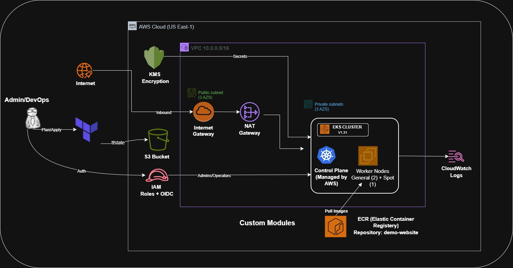


### Component Details

**VPC Network**: 10.0.0.0/16 with public (10.0.1-3/24) and private (10.0.11-13/24) subnets across 3 AZs

**EKS Cluster**: Kubernetes 1.31 with AWS-managed control plane, etcd encrypted with KMS, and 4 worker node groups for high availability

**AWS Services**:
- **ECR**: Docker image repository for the demo website
- **IAM/OIDC**: IRSA (IAM Roles for Service Accounts) for pod-level permissions
- **KMS**: Encryption for etcd and EBS volumes
- **CloudWatch**: Logs and metrics for monitoring
- **Secrets Manager**: Optional secret storage for database and API credentials

---

## Demo Steps

### Step 1: Provision Infrastructure

```bash
cd /c/Users/amitk/Projects/TerraformCourse/TerraformFullCourse/Day-20/terraform
terraform init
terraform validate
terraform plan
terraform apply
```

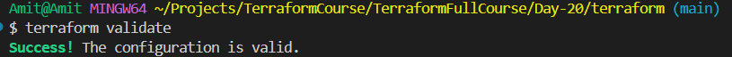

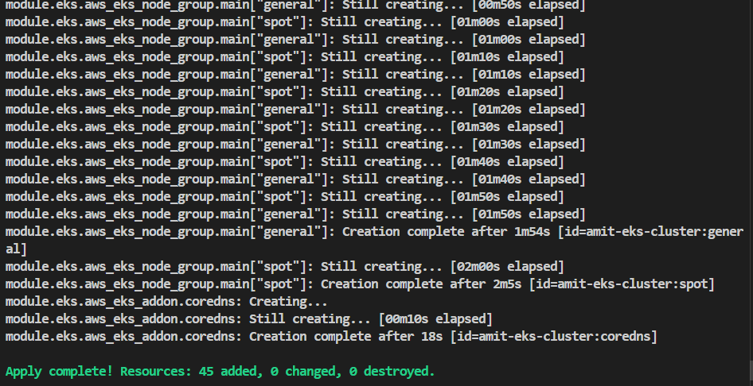

---

### Step 2: Configure kubectl

```bash
terraform output -raw configure_kubectl
```

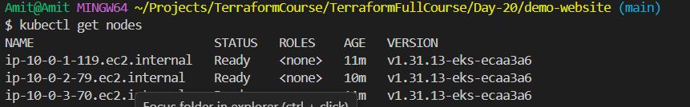

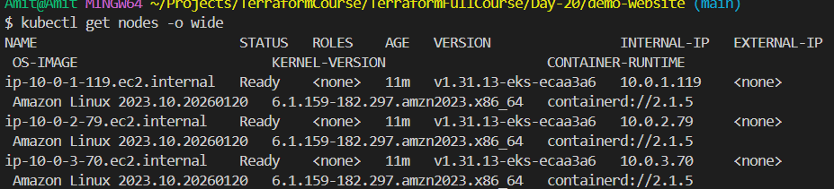

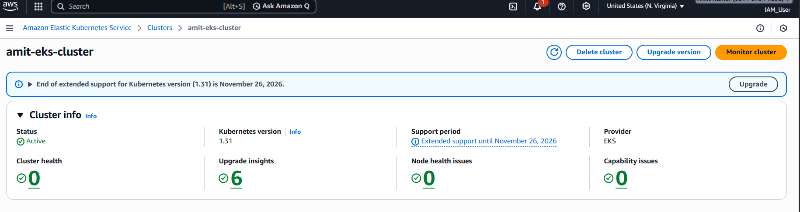

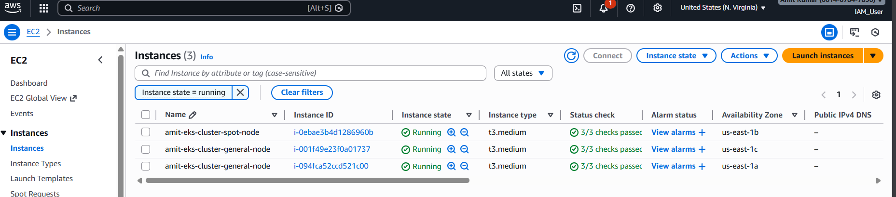

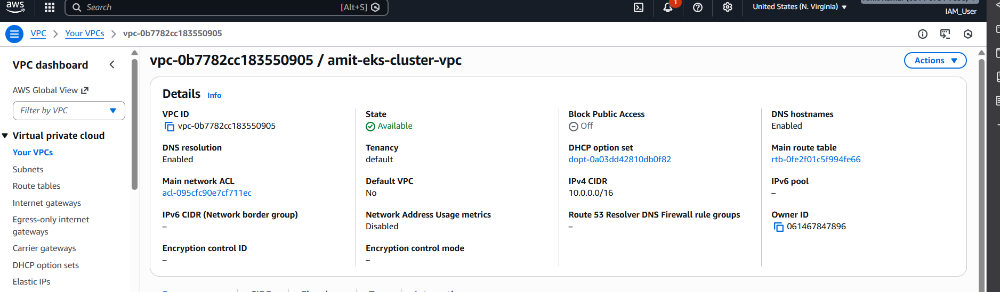

---

### Step 3: Build and Push Docker Image

```bash
cd ../demo-website
docker build -t demo-website:latest .
```

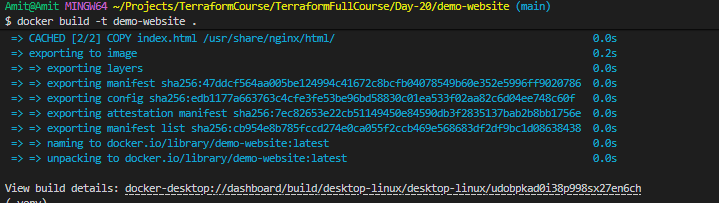

---

```bash
cd ../terraform
terraform output ecr_repository_url
terraform output -raw ecr_login_command

docker tag demo-website:latest <ECR_URL>:latest
docker push <ECR_URL>:latest
```

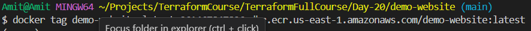

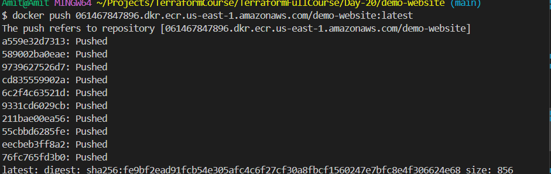

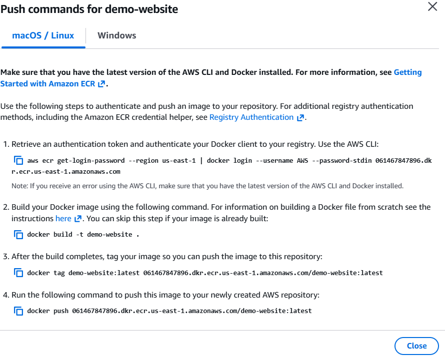

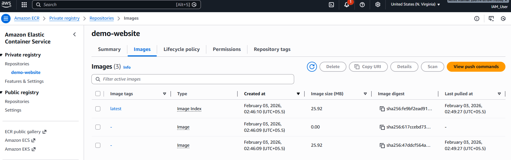

---

### Step 4: Deploy Application to EKS

```bash
cd ../demo-website
kubectl apply -f deployment.yaml
```

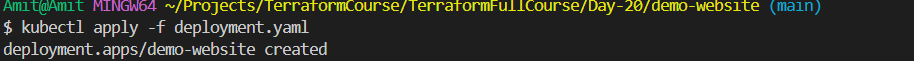

---

```bash
kubectl apply -f service.yaml
kubectl get svc demo-website -o wide
```

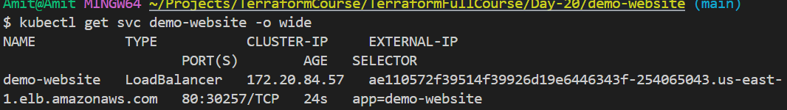

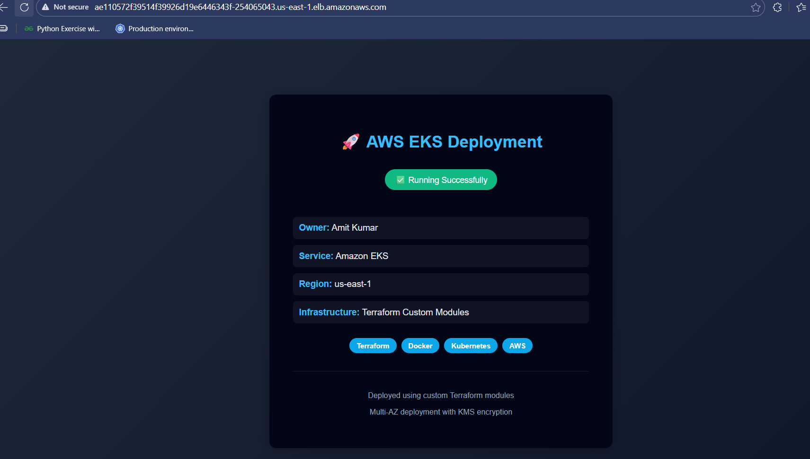


---

### Step 5: Cleanup

```bash
kubectl delete svc demo-website
```

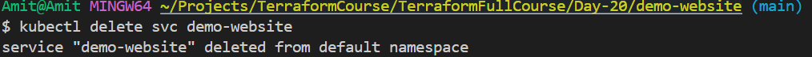

---

```bash
kubectl delete deployment demo-website
```

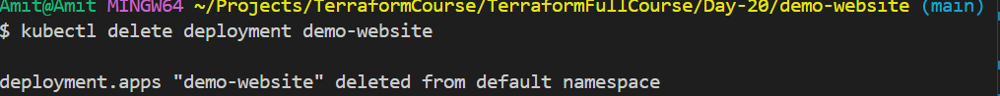

---

```bash
cd ../terraform
terraform destroy
```

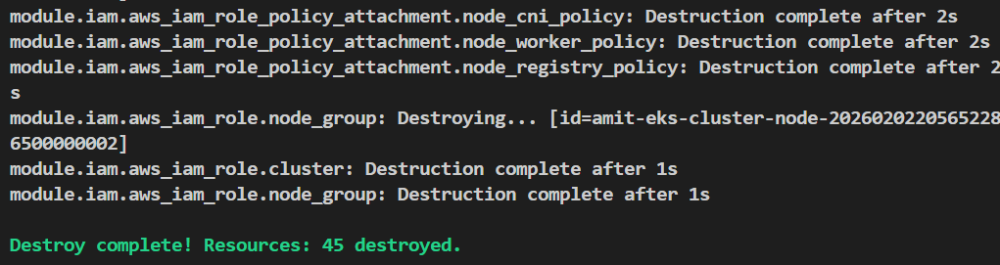

---

## Summary

This demo demonstrated:
- Provisioning a production-ready EKS cluster with Terraform custom modules
- Building and pushing Docker images to ECR
- Deploying containerized applications to Kubernetes
- Exposing services with LoadBalancers
- Cleaning up all resources

All resources are managed by Infrastructure as Code, enabling repeatable and auditable deployments.
