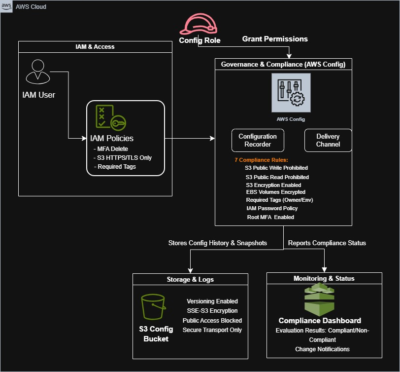
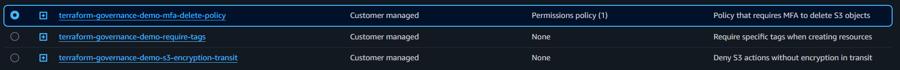
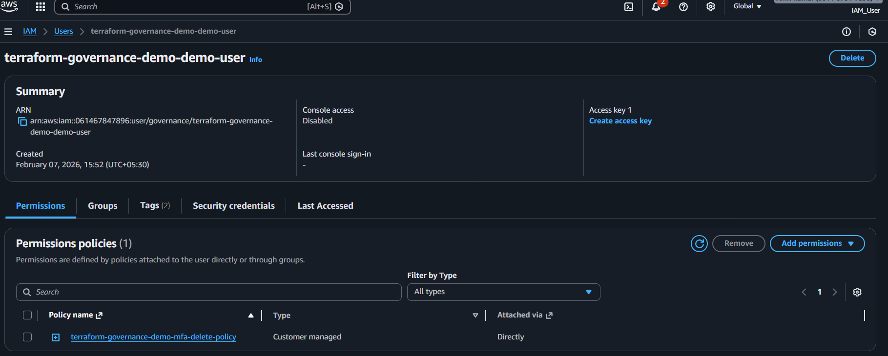
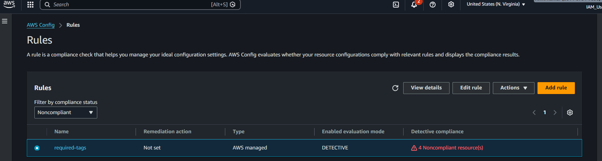
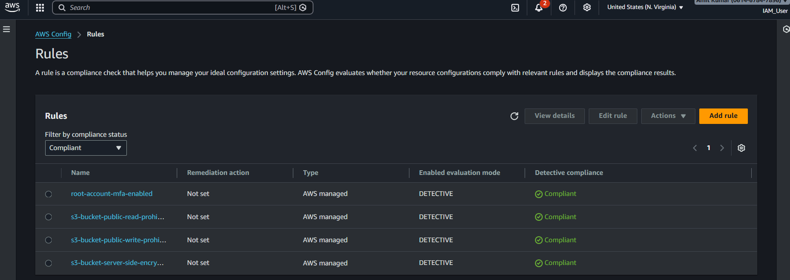
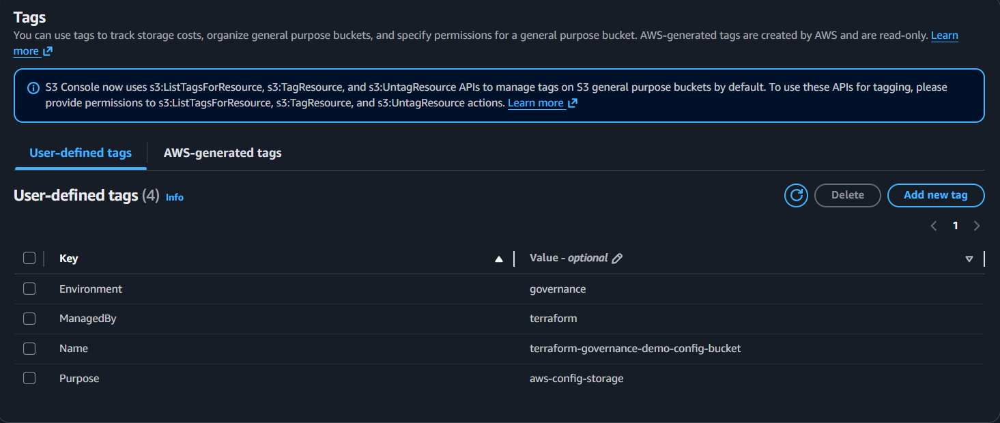
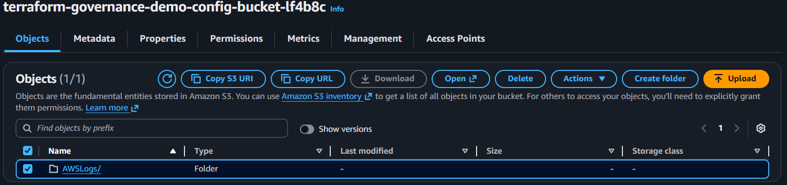
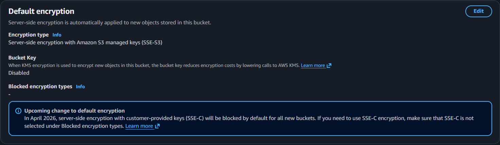

# Day 21: AWS Policy and Governance (Mini Project 7)

This project demonstrates how to implement **AWS Policy Creation** and **Governance Setup** using Terraform. It showcases best practices for cloud security, compliance monitoring, and automated policy enforcement.



## ✅ Recruiter Highlights

- Infrastructure as Code with repeatable governance patterns
- Defense-in-depth: IAM guardrails + AWS Config monitoring
- Secure S3 storage with encryption, versioning, and public access controls
- Compliance evidence captured via AWS Config rule evaluations

## 🎯 Project Objectives

1. **Policy Creation**: Implement IAM policies to enforce security best practices
2. **Governance Setup**: Configure AWS Config for continuous compliance monitoring
3. **Resource Tagging**: Demonstrate tagging strategies for resource management
4. **S3 Security**: Apply encryption, versioning, and access controls
5. **Compliance Monitoring**: Track configuration changes and detect violations

## 📁 Project Structure

```
Day-21/
├── Assets/
├── Readme.md
└── terraform/
	├── config.tf        # AWS Config recorder and rules
	├── iam.tf           # IAM policies, users, and roles
	├── main.tf          # S3 bucket and shared resources
	├── outputs.tf       # Output values
	├── provider.tf      # AWS provider configuration
	└── variables.tf     # Input variables
```


## 🔐 IAM Policies Created

### 1. MFA Delete Policy
Denies S3 object deletion unless Multi-Factor Authentication is present.

### 2. S3 Encryption in Transit Policy
Requires HTTPS/TLS for all S3 operations.

### 3. Required Tags Policy
Enforces tagging standards for EC2 instances and other resources.

### 4. Demo IAM User
Sample user with attached policies for demonstration purposes.




## 🛡️ AWS Config Rules

This project configures **6 compliance rules**:

1. **S3 Public Write Prohibited** - Prevents public write access to S3 buckets
2. **S3 Encryption Enabled** - Ensures server-side encryption on S3 buckets
3. **S3 Public Read Prohibited** - Blocks public read access to S3 buckets
4. **EBS Volumes Encrypted** - Verifies all EBS volumes are encrypted
5. **Required Tags** - Checks for Environment and Owner tags
6. **Root MFA Enabled** - Ensures root account has MFA configured




## 🚀 Usage

### Prerequisites

- AWS CLI configured with appropriate credentials
- Terraform >= 1.0
- AWS account with permissions to create IAM roles, policies, Config, and S3 resources

### Deployment Steps

1. **Move to the Terraform folder**
	```bash
	cd Day-21/terraform
	```

2. **Initialize Terraform**
	```bash
	terraform init
	```

3. **Review the Plan**
	```bash
	terraform plan
	```

4. **Apply the Configuration**
	```bash
	terraform apply
	```

5. **View Outputs**
	```bash
	terraform output
	```

### Customize Variables

You can override default values:

```bash
terraform apply -var="aws_region=us-west-2" -var="project_name=my-governance"
```

## 🔒 S3 Security Evidence





## 📊 Monitoring Compliance

After deployment, you can monitor compliance through:

1. **AWS Console**: Navigate to AWS Config → Rules
2. **AWS CLI**: 
   ```bash
   aws configservice describe-compliance-by-config-rule
   ```

## 🧹 Cleanup

To destroy all resources:

```bash
terraform destroy
```

**Note**: The S3 bucket will be force-destroyed, including all stored Config snapshots.


## 💡 Key Learning Points

1. **Policy as Code**: IAM policies defined in Terraform are version-controlled and repeatable
2. **Continuous Compliance**: AWS Config continuously monitors resources against rules
3. **Defense in Depth**: Multiple layers of security (IAM, S3 policies, encryption)
4. **Automated Governance**: No manual intervention needed for compliance checks
5. **Tagging Strategy**: Consistent tagging enables cost tracking and resource management

## 📝 Best Practices Implemented

- ✅ Least privilege access with IAM policies
- ✅ Encryption at rest and in transit
- ✅ S3 bucket versioning for audit trail
- ✅ Public access blocking on sensitive buckets
- ✅ Resource tagging for governance
- ✅ Continuous configuration monitoring
- ✅ Automated compliance reporting

## 🔗 Resources

- [AWS Config Documentation](https://docs.aws.amazon.com/config/)
- [AWS IAM Best Practices](https://docs.aws.amazon.com/IAM/latest/UserGuide/best-practices.html)
- [Terraform AWS Provider](https://registry.terraform.io/providers/hashicorp/aws/latest/docs)
- [AWS Config Rules](https://docs.aws.amazon.com/config/latest/developerguide/managed-rules-by-aws-config.html)

---

