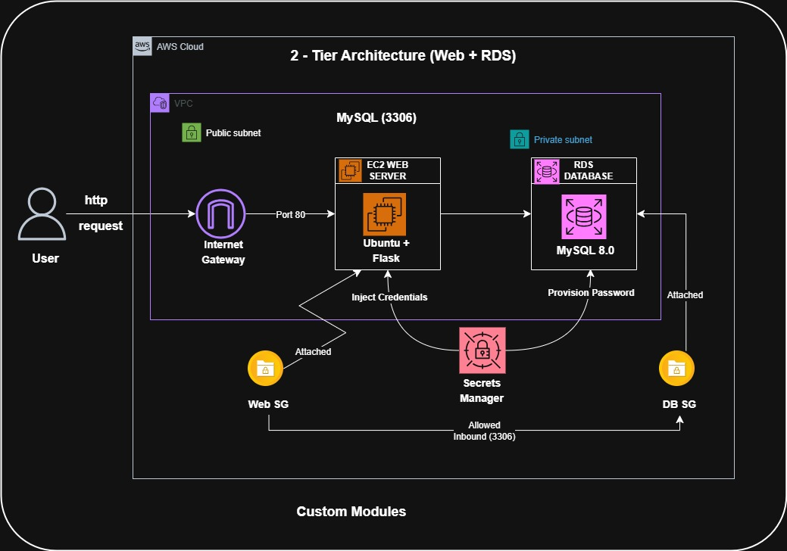
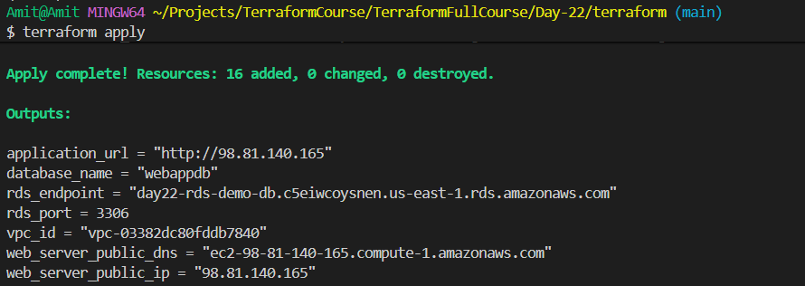
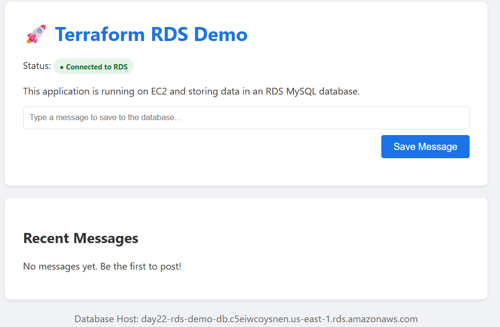
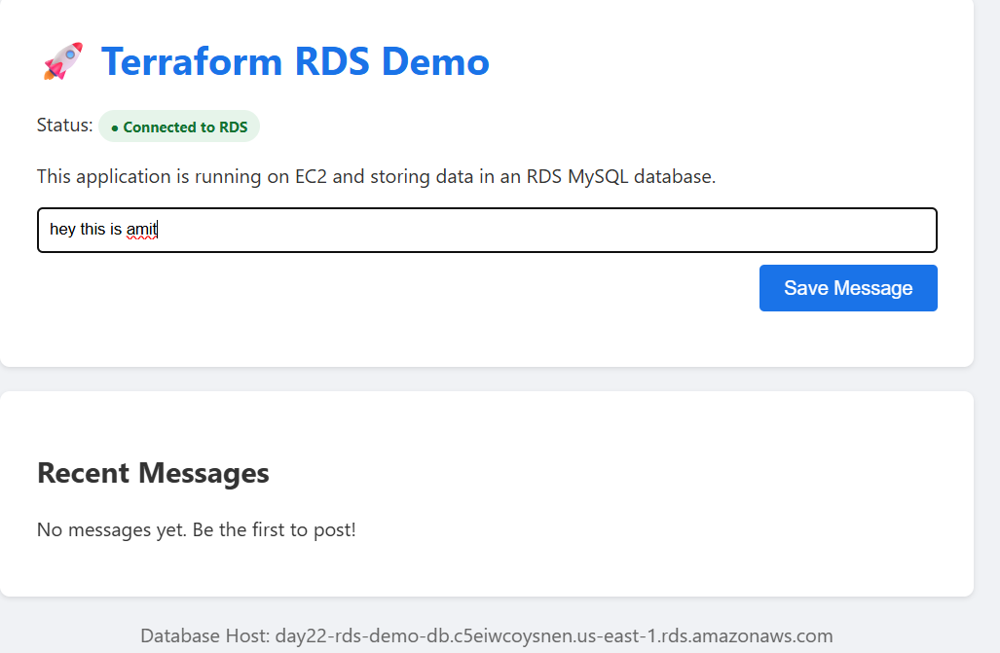
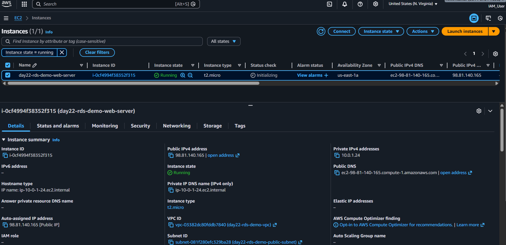

# [~] Demo Guide: AWS Two-Tier Architecture

## [i] Project Overview
This project demonstrates a production-ready, modular architecture pattern on AWS using Terraform. It deploys a dynamic web application that securely connects to a managed relational database.

### Key Learning Objectives:
*   **Modular Terraform**: Breaking down complex infrastructure into reusable components (`vpc`, `ec2`, `rds`, `security_groups`, `secrets`).
*   **Secret Management**: Eliminating hardcoded passwords by using AWS Secrets Manager and the Terraform random provider.
*   **Secure Networking**: Placing databases in private subnets and using Security Groups to enforce least-privilege access.
*   **Automated Bootstrapping**: Using EC2 `user_data` to install software and configure the application at launch.

---

## [~] Architecture
The infrastructure is designed for security and network-level isolation.



### Component Details
| Component | Specification | Description |
| :--- | :--- | :--- |
| **VPC** | 10.0.0.0/16 | Custom network with DNS hostnames enabled. |
| **Public Subnet** | 10.0.1.0/24 | Hosts the Web Server. Direct internet access via IGW. |
| **Private Subnets**| 10.0.2.0/24, 10.0.3.0/24 | Hosts the RDS instance across 2 Availability Zones. |
| **EC2 Instance** | t2.micro / Ubuntu | Runs the Flask application. Bootstrapped via `user_data`. |
| **RDS Instance** | db.t3.micro / MySQL | Managed database service in a private Subnet Group. |
| **Secrets Manager**| Standard Secret | Stores auto-generated database credentials securely. |

---

## [>] Code Walkthrough

### 1. The Secret Generator (`modules/secrets/main.tf`)
Passwords are generated automatically and stored in a secure vault.
```hcl
# Generate a random 16-character password
resource "random_password" "db_password" {
  length           = 16
  special          = true
  override_special = "!#$%&*()-_=+[]{}<>:?"
}

# Store it in AWS Secrets Manager
resource "aws_secretsmanager_secret_version" "db_password" {
  secret_id     = aws_secretsmanager_secret.db_password.id
  secret_string = jsonencode({
    username = var.db_username
    password = random_password.db_password.result
  })
}
```

### 2. Wiring Modules (`main.tf`)
Data flows between modules, passing secrets from the source to the dependents.
```hcl
module "rds" {
  source      = "./modules/rds"
  db_password = module.secrets.db_password  # Passing the secret
}

module "ec2" {
  source      = "./modules/ec2"
  db_password = module.secrets.db_password  # Passing the secret
}
```

### 3. Auto-Configuring the App (`modules/ec2/templates/user_data.sh`)
Terraform injects credentials into the application code before launch.
```python
# Inside the Python Flask App (Injected by Terraform)
DB_CONFIG = {
    "host": "${db_host}",
    "user": "${db_username}",
    "password": "${db_password}",
    "database": "${db_name}"
}
```

---

## [!] Prerequisites
*   **Terraform v1.0+**: `terraform version`
*   **AWS CLI**: `aws configure` (Region: us-east-1)
*   **IAM Permissions**: Full access to EC2, VPC, RDS, and Secrets Manager.

---

## [>] Deployment Guide

### Step 1: Initialization
Initialize the working directory and download providers.
```bash
terraform init
```

### Step 2: Planning
Preview the changes and dependency graph.
```bash
terraform plan
```

### Step 3: Application
Apply the configuration. Note: RDS instances take 5-10 minutes to provision.
```bash
terraform apply -auto-approve
```



---

## [#] Verification & Testing

### 1. Web Application Dashboard
Look for the `application_url` in the outputs.
*   **Status Check**: Verify the green "● Connected to RDS" badge.
*   **Interactive Test**: Save a message and verify it appears in "Recent Messages".




### 2. AWS Console Verification
*   **EC2**: Verify Security Group allows Port 80 from `0.0.0.0/0`.


*   **RDS**: Verify it is in the private subnets and allows Port 3306 **only** from the Web SG.


*   **Secrets**: Retrieve the secret value to see the Terraform-generated password.


---

## [*] Under the Hood

### The "No-Hardcoded-Secrets" Workflow
1.  **Generation**: `random_password` creates a complex string.
2.  **Storage**: Stored immediately in `aws_secretsmanager_secret_version`.
3.  **Injection**: Passed via module outputs to RDS (master pwd) and EC2 (app config).

### The Modular Structure
*   **Root (`main.tf`)**: The conductor orchestrating data flow between modules.
*   **Child Modules**: Encapsulated logic for specific resources, making code reusable.

---

## [-] Clean Up
Destroy resources when finished to avoid AWS charges.
```bash
terraform destroy -auto-approve
```

---

### **Happy Terraforming, Happy Deploying!** >>