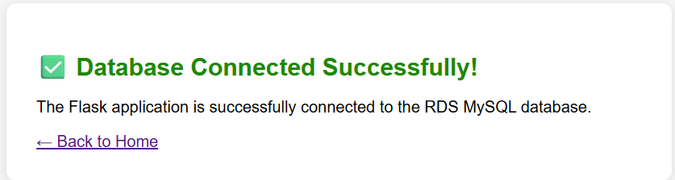
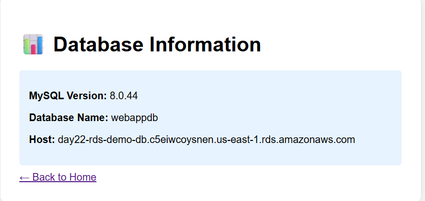

# AWS Two-Tier Web Application Deployment with Terraform

[](https://www.terraform.io/)
[](https://aws.amazon.com/)
[](https://flask.palletsprojects.com/)

## [i] Overview
This project showcases the end-to-end deployment of a two-tier web application on AWS using Terraform. It focuses on building a secure, scalable, and modular cloud infrastructure by following real-world DevOps and Infrastructure-as-Code practices.

**Detailed Step-by-Step Guide:** [Read the full blog post on Dev.to](https://dev.to/amit_kumar_7db8e36a64dd45/-day-22-2-tier-architecture-setup-on-aws-using-terraform-363j)

The architecture separates the application and database layers to improve security and maintainability. A Flask-based web application runs on an EC2 instance in a public subnet, while the MySQL database is hosted on Amazon RDS in private subnets.

The deployed infrastructure includes:
*   **Networking**: A custom VPC with public and private subnets for proper network isolation.
*   **Web Tier**: An EC2 instance running a Flask application on Ubuntu, accessible over HTTP.
*   **Database Tier**: A managed Amazon RDS MySQL instance deployed in private subnets for enhanced security.
*   **Security**: Carefully configured security groups and AWS Secrets Manager for secure credential management.

This project demonstrates practical experience in designing, provisioning, and managing cloud infrastructure using Terraform on AWS.

---

## [~] Architecture
The following diagram illustrates the network flow and component placement within the AWS environment.


### Infrastructure Components:
*   **VPC (10.0.0.0/16)**: The isolated network boundary.
*   **Public Subnet**: Hosts the EC2 Web Server with an Internet Gateway for public access.
*   **Private Subnets**: Spread across multiple Availability Zones to host the RDS MySQL instance securely.
*   **Internet Gateway**: Provides connectivity for the public subnet.
*   **Route Tables**: Manages traffic flow between subnets and the internet.

---

## [+] Project Structure
```text
.
├── Assets/                 # Project Screenshots
├── terraform/              # Infrastructure-as-Code
│   ├── modules/            # VPC, EC2, RDS, Secrets, SGs
│   ├── main.tf             # Root Orchestration
│   ├── variables.tf        # Input Variables
│   └── outputs.tf          # Deployment Outputs
└── README.md
```

---

## [!] Prerequisites
*   [AWS CLI](https://aws.amazon.com/cli/) configured with appropriate IAM permissions.
*   [Terraform](https://www.terraform.io/downloads) (>= 1.0) installed on your local machine.
*   An active AWS Account.

---

## [>] Usage Guide

### 1. Initialization
Prepare the directory by downloading the necessary providers.
```bash
cd terraform
terraform init
```

### 2. Planning
Review the infrastructure changes before applying them.
```bash
terraform plan
```

### 3. Deployment
Provision the AWS resources.
```bash
terraform apply -auto-approve
```

### 4. Accessing the Application
Once the deployment is complete, Terraform will provide the `application_url`.


Open the URL in your browser to interact with the Flask application:
*   ` / ` : Home page with message submission.
*   ` /health ` : Database connectivity check.
*   ` /db-info ` : View database engine and version details.

---

## [#] Application Preview

| Home Page | DB Connection Success |
| :---: | :---: |
|  |  |

| Message Submission | Database Metadata |
| :---: | :---: |
|  |  |

---

## [*] Modules Depth

### [v] VPC Module
Builds the foundation including the VPC core, public/private subnets, and routing logic.


### [s] Security Groups Module
*   **Web SG**: Allows inbound HTTP (80) and SSH (22) from anywhere.
*   **DB SG**: Allows inbound MySQL (3306) **only** from the Web Server security group.

### [d] RDS & Secrets Module
Sets up a secure MySQL instance and stores credentials in AWS Secrets Manager.


### [c] EC2 Module
Launches the Ubuntu instance and executes the `user_data.sh` script to:
1. Update system packages.
2. Install Python and Flask.
3. Configure the application to connect to the RDS endpoint.


---

## [!] Security Notes
*   **Credential Management**: The `db_password` is managed via AWS Secrets Manager. Never commit plain-text passwords to version control.
*   **Access Control**: SSH access is currently open (`0.0.0.0/0`) for demo purposes. In production, restrict this to your specific IP address.
*   **Encryption**: Consider enabling Storage Encryption (`storage_encrypted = true`) for the RDS instance in production environments.

---

## [-] Clean Up
To avoid ongoing AWS charges, destroy the infrastructure when finished:
```bash
terraform destroy -auto-approve
```

---

## [=] Outputs
| Output | Description |
| :--- | :--- |
| `vpc_id` | ID of the created Virtual Private Cloud. |
| `web_server_public_ip`| Public IP address of the EC2 instance. |
| `application_url` | The primary URL to access the Flask web application. |
| `rds_endpoint` | The DNS endpoint for the MySQL database. |
| `database_name` | The name of the initialized MySQL database. |

---

### **Happy Terraforming, Happy Deploying!** >>